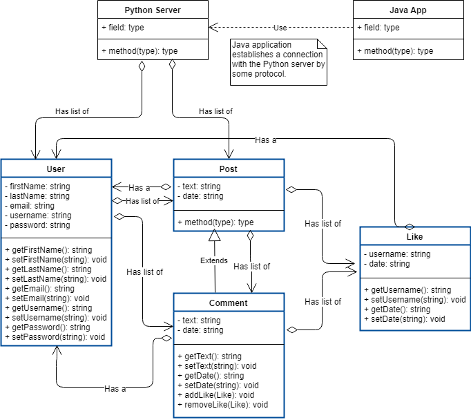

# PyBook
**Team Members**
  * Sumner Bradley  sumner.bradley@ucdenver.edu
  * Daniel Cahoon	  daniel.cahoon@ucdenver.edu
  * Abyel Romero		abyel.romero@ucdenver.edu
  * Nicholas Kong	  nicholas.kong@ucdenver.edu
## Project Description
       A social media application with a post, comment, and like functionality. This project will consist of a Python server for storage and data processing and a Java application for displaying the information to the user. Our goals for this project are to practice Python and Java in a practical application as well as learn how to implement the server-client relationship.\
       The relationship between the Python server and Java client will be established by a protocol to be chosen at a later date. The connection, data requests, and posts will be initiated through the Java client and fulfilled by the Python server. This application will be designed for Windows and Mac desktop environments due to Java’s high portability.\
       This project is being developed for educational purposes during the fall 2018 semester in the course Advanced Programming with Java and Python taught by Javier Pastorino at the University of Colorado Denver.
## UML Design

